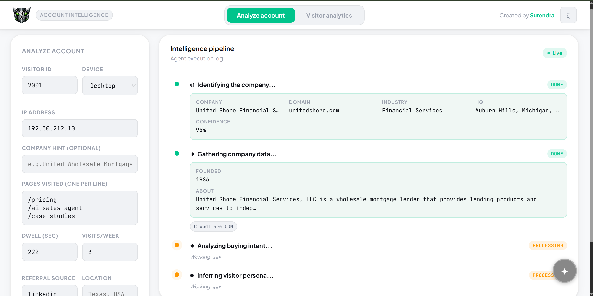
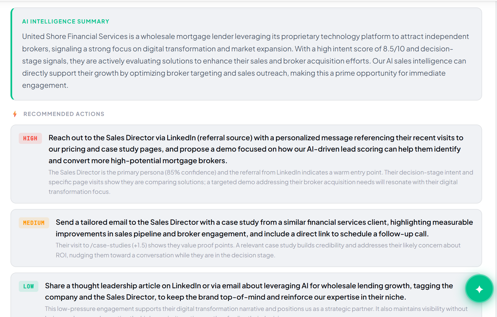

# ⬡ NEXUS — AI Account Intelligence & Enrichment System

> Turn anonymous website visitors into complete, sales-ready intelligence reports — automatically, using a parallel multi-agent AI pipeline.

   

**Live demo:** https://nexusiq.vercel.app &nbsp;·&nbsp; **Backend API:** https://nexus-backend-gh8g.onrender.com/docs

---

## Screenshots

**Analyze Account** — feed a visitor signal (IP + behavioral data); five agents stream their results into a live execution log.



**AI summary + recommended actions** — the synthesizer turns the raw intel into a narrative and three prioritized, reasoned sales plays.



---

## The Problem

Sales and marketing teams are blind to who visits their website. An IP address and a list of pages tell you nothing actionable. Analytics tools show traffic — but not *who* the visitor is, what company they represent, or how sales should act.

NEXUS solves this in real time:

| Input | Output |
|---|---|
| Visitor ID + IP + pages + dwell + device | Company identity + buyer intent score + persona |
| Any combination of the above | Full firmographic profile + tech stack + leadership |
| Either | AI intelligence summary + prioritized sales actions |

---

## System Architecture

```
INPUT
  Visitor Signal: ID · IP · pages · dwell · visits · device · location · referral
                            │
                            ▼
              ┌─────────────────────────┐
              │      ORCHESTRATOR        │
              │   Routes · fans out      │
              └────────────┬────────────┘
                           │
        ┌──────────────────┼──────────────────┐
        ▼                  ▼                  ▼                ▼
  ┌──────────┐    ┌──────────────┐    ┌────────────┐    ┌──────────┐
  │Identifier│    │   Enricher   │    │Intent Score│    │ Persona  │
  │  Agent   │    │   Agent      │    │   Agent    │    │  Agent   │
  └────┬─────┘    └──────┬───────┘    └─────┬──────┘    └────┬─────┘
       │                 │                  │                 │
  ip-api.com      Hunter.io           DeepSeek           DeepSeek
                + AbstractAPI         reasoning           reasoning
                + Wikipedia
                + HTTP scraper
        │                 │                  │                 │
        └─────────────────┴──────────────────┴─────────────────┘
                                    │
                                    ▼
                       ┌────────────────────────┐
                       │     SYNTHESIZER         │
                       │  AI summary + actions   │
                       └────────────────────────┘
                                    │
                                SSE stream
                                    │
                       ┌────────────────────────┐
                       │    React Dashboard      │
                       │  Live agent log · tabs  │
                       │  Ask Agent chat bubble  │
                       └────────────────────────┘
```

### Key Design Decisions

- **Parallel agents via `asyncio.gather`** — Enricher, Intent Scorer, and Persona Agent run simultaneously. ~3x faster than sequential chaining.
- **SSE streaming** — the backend streams `AgentEvent` objects as each agent completes. The UI updates live — you watch the pipeline think, not just see a final result.
- **Enrichment waterfall** — Hunter.io → AbstractAPI → Wikipedia → HTTP header scraping → LLM fallback. The system always returns something useful, never an empty profile.
- **Data confidence scoring** — every `CompanyProfile` carries a `confidence: float` (0.0–1.0) computed from how many independent sources contributed data.
- **Unified visitor signal** — a single input captures all behavioral signals: visitor ID, IP, company hint, pages visited, dwell time, visit frequency, device, location, referral source, timestamp.
- **Ask Agent** — a floating chat interface with full intel context. Ask questions about any account in natural language — markdown responses, powered by DeepSeek.
- **Simulated visitor dataset** — `/api/visitors` serves 20 seeded realistic visitors for the analytics dashboard; new visitors trickle in client-side every 8–14s to simulate live traffic.

---

## Features

**Analyze Account**
- Visitor signal input: IP + behavioral signals → full company identity
- 5 parallel agents stream results in real time via SSE
- Live agent execution log with descriptive status messages
- Full intelligence report: firmographics, tech stack, leadership, business signals
- Intent score (0–10) with stage classification (Awareness → Decision)
- Persona inference: likely role, department, seniority, confidence
- AI intelligence summary + 3 prioritized sales actions

**Visitor Analytics**
- Live visitor feed with company, pages, device, intent score, stage
- Intent stage breakdown funnel (Decision / Evaluation / Research / Awareness)
- Top pages by visit count
- Top accounts ranked by max intent score
- Click any visitor → full detail + one-click pipeline trigger

**Ask Agent**
- Floating `✦` chat bubble (bottom-right)
- Full account intel baked into system context
- Suggested questions on open
- Markdown-rendered responses
- Resets automatically on new pipeline run

---

## Tech Stack

| Layer | Tech |
|---|---|
| LLM | DeepSeek Chat (OpenAI-compatible API) |
| Backend | FastAPI + asyncio + Python 3.11 |
| Agents | Custom typed agents (PydanticAI pattern) |
| Data sources | ip-api.com · Hunter.io · AbstractAPI · Wikipedia · HTTP scraper |
| Streaming | Server-Sent Events (SSE) |
| Frontend | React 18 + Vite + TypeScript |
| Styling | CSS variables, dark/light theme |
| Deploy | Render (backend) + Vercel (frontend) |

---

## Project Structure

```
nexus/
├── backend/
│   ├── main.py              # FastAPI app, SSE pipeline, analytics endpoints, Ask Agent
│   ├── models.py            # All Pydantic schemas
│   ├── llm.py               # DeepSeek client + chat / chat_json utilities
│   ├── agents/
│   │   └── agents.py        # 5 specialist agents (identifier, enricher, intent, persona, synthesizer)
│   ├── tools/
│   │   └── data_tools.py    # ip-api, Hunter, AbstractAPI, Wikipedia, tech stack scraper
│   ├── .python-version      # Pins Python 3.11.9
│   ├── requirements.txt
│   └── .env.example
└── frontend/
    ├── src/
    │   ├── App.tsx           # Main app, InputPanel, IntelReport, LogEntry, all components
    │   ├── App.css           # Full design system (dark/light theme, CSS variables)
    │   ├── AnalyticsPage.tsx # Visitor analytics dashboard
    │   └── AskAgent.tsx      # Floating chat agent with markdown renderer
    ├── package.json
    ├── tsconfig.json
    ├── vite.config.ts
    └── index.html
```

---

## Local Setup

### Prerequisites
- Python 3.11+ (or [`uv`](https://docs.astral.sh/uv/) — it will fetch 3.11.9 automatically)
- Node.js 18+
- DeepSeek API key — [platform.deepseek.com](https://platform.deepseek.com)
- Hunter.io API key — optional, free at [hunter.io](https://hunter.io)
- AbstractAPI key — optional, free at [app.abstractapi.com](https://app.abstractapi.com)

### Backend

```bash
cd nexus/backend

# with uv (recommended)
uv venv                       # creates .venv using .python-version (3.11.9)
uv pip install -r requirements.txt

# ...or with stock venv
python -m venv venv
venv\Scripts\activate          # Windows  ·  source venv/bin/activate elsewhere
pip install -r requirements.txt

cp .env.example .env           # then add DEEPSEEK_API_KEY

uv run uvicorn main:app --reload --port 8000
```

API docs: `http://localhost:8000/docs`

### Frontend

```bash
cd nexus/frontend
npm install
npm run dev
```

Open `http://localhost:5173`. Vite proxies `/api` → `http://localhost:8000`.

---

## API Endpoints

| Method | Endpoint | Description |
|---|---|---|
| `POST` | `/api/enrich/stream` | SSE pipeline — streams `AgentEvent` objects |
| `POST` | `/api/ask` | Ask Agent — answers questions with full intel context |
| `GET` | `/api/visitors` | Simulated visitor dataset (20 records) |
| `GET` | `/api/visitors/stats` | Aggregated analytics stats |
| `GET` | `/health` | Health check |
| `GET` | `/docs` | Auto-generated Swagger UI |

### SSE Payload Example

```
POST /api/enrich/stream
{
  "mode": "visitor",
  "visitor": {
    "visitor_id": "V001",
    "ip": "34.201.100.50",
    "pages_visited": ["/pricing", "/ai-sales-agent", "/case-studies"],
    "time_on_site_seconds": 222,
    "visits_this_week": 3,
    "referral_source": "linkedin",
    "device": "Desktop",
    "location": "Texas, USA"
  }
}

→ data: {"agent":"identifier","status":"running",...}
→ data: {"agent":"identifier","status":"done","data":{"name":"Acme Mortgage",...}}
→ data: {"agent":"enricher","status":"running",...}
→ data: {"agent":"intent","status":"running",...}
→ data: {"agent":"persona","status":"running",...}
→ data: {"agent":"enricher","status":"done","data":{...}}
→ data: {"agent":"intent","status":"done","data":{"score":8.4,"stage":"Evaluation",...}}
→ data: {"agent":"persona","status":"done","data":{"likely_role":"VP Sales Operations",...}}
→ data: {"agent":"synthesis","status":"running",...}
→ data: {"agent":"synthesis","status":"done","data":{...}}
→ data: {"agent":"complete","status":"done","data":{full AccountIntelligence}}
```

---

## Deployment

**Backend → Render (free)**
1. Push to GitHub
2. render.com → New Web Service → connect repo
3. Root directory: `nexus/backend`
4. Build: `pip install -r requirements.txt`
5. Start: `uvicorn main:app --host 0.0.0.0 --port $PORT`
6. Env vars: `DEEPSEEK_API_KEY`, `HUNTER_API_KEY` (optional), `ABSTRACT_API_KEY` (optional)

**Frontend → Vercel (free)**
1. vercel.com → New Project → import repo
2. Root directory: `nexus/frontend`
3. Env var: `VITE_API_URL=https://your-backend.onrender.com`
4. Deploy

---

## Evaluation Coverage

| Criterion | How NEXUS delivers |
|---|---|
| System design & architecture | Parallel multi-agent pipeline, typed Pydantic outputs, SSE streaming |
| Use of AI agents & LLM workflows | 5 specialist agents with focused prompts, structured JSON outputs, Ask Agent |
| Handling messy real-world data | 4-source enrichment waterfall, confidence scoring, graceful fallbacks |
| Structured outputs & reasoning | Full Pydantic schema, reasoning fields on intent + persona agents |
| Creativity & builder mindset | Live agent log, visitor analytics tab, Ask Agent chat, dark/light theme |
| Working end-to-end prototype | Deployed on Render + Vercel, live at nexusiq.vercel.app |

---

Built in ~13 hours for the Fello AI Builder Hackathon.
